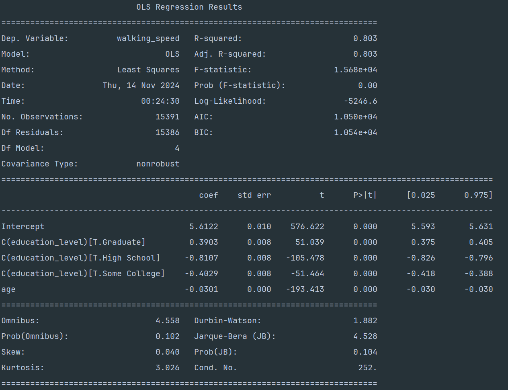
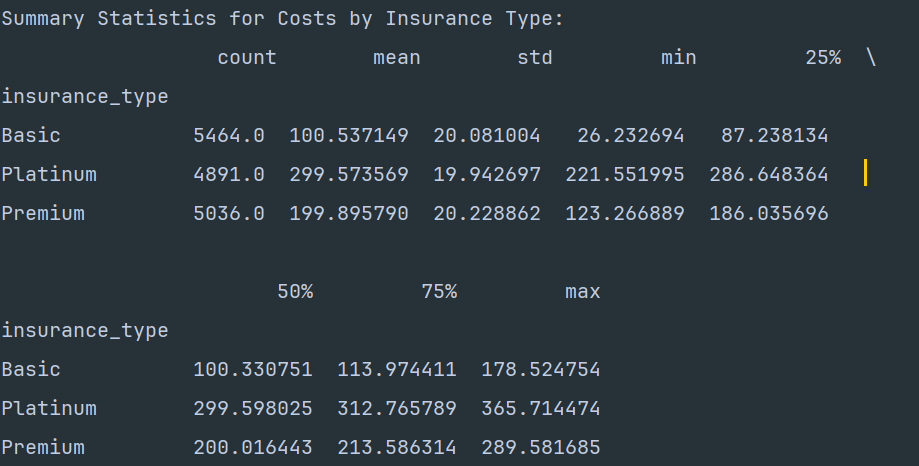
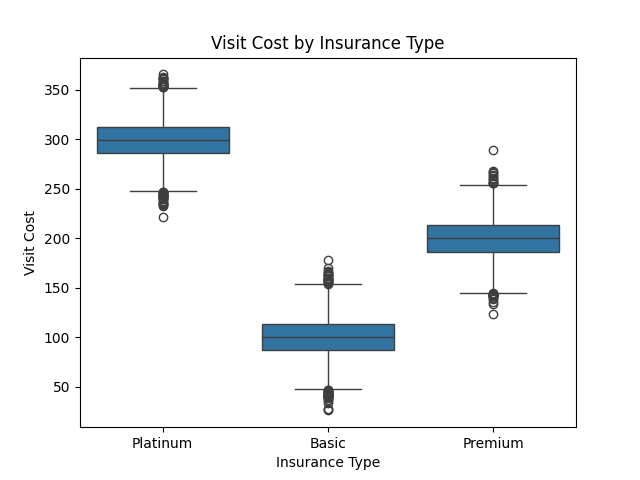
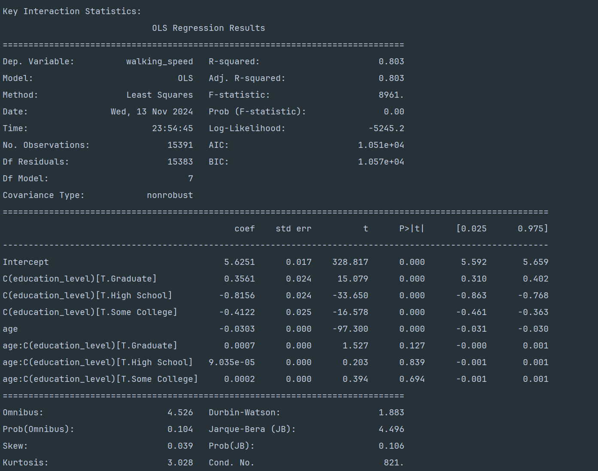
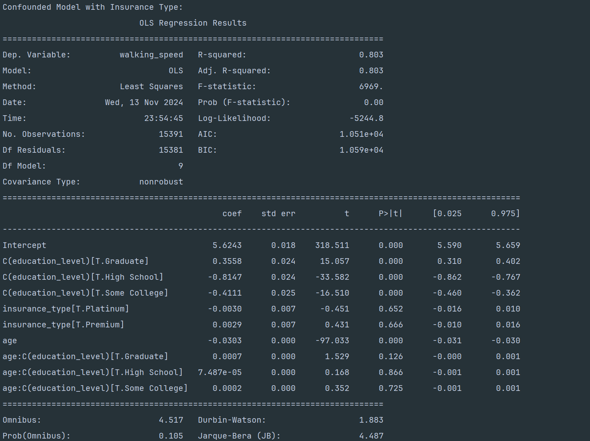

# Exam 2 by Eric Yang
## Question 1: Data Preparation with Command-Line Tools (20 points)
After running`generate_dirty_data.py` to create `ms_data_dirty.csv`,
`prepare.sh` is created to do data cleaning on `ms_data_dirty.csv`.

1. Here is the following connotation with the code in bash for data cleaning and output to `ms_data_csv`:
```bash
# Remove comment lines, empty lines, extra commas
grep -v '^#' ms_data_dirty.csv | sed '/^$/d' | sed 's/,,*/,/g' | \
# Extract the essential columns: patient_id, visit_date, age, education_level, walking_speed
cut -d',' -f1,2,4,5,6 | \
# Filter for rows with walking speed between 2.0 and 8.0 feet/second and save the cleaned data as ms_data.csv
awk -F',' '{if (NR==1 || ($5 >= 2.0 && $5 <= 8.0)) print}' > ms_data.csv
```
2. create `insurance.lst`with insurance type 
```bash
# Step 2: Create insurance.lst with unique insurance types
echo -e "insurance_type\nBasic\nPremium\nPlatinum" > insurance.lst
```
3. Create a summary of the processed data:
```bash
# Step 3: Generate a summary of the cleaned data
# Count total number of visits 
total_visits=$(tail -n +2 ms_data.csv | wc -l)
echo "Total number of visits: $total_visits"
# Display the first few records of the cleaned data
echo "First few records:"
head -n 8 ms_data.csv
```
We can see that by these commands a new cleaned data set `ms_data.csv`is created with showing the number of visits and showing the first 8 rows of data.
## Question 2: Data Analysis with Python (25 points)

First, we include python packages to assist our code:
```python
import pandas as pd
import numpy as np
```
### 1. Load and structure the data:
```python
#Read the processed CSV file
dt = pd.read_csv('ms_data.csv')
#Convert visit_date to datetime
dt['visit_date'] = pd.to_datetime(dt['visit_date'])
#Sort by patient_id and visit_date
dt = dt.sort_values(by=['patient_id', 'visit_date']).reset_index(drop=True)
```
### 2. Add insurance information:
```python
#Read insurance types from insurance.lst
insurance_types = pd.read_csv('insurance.lst', header=0, names=['insurance_type'])
insurance_labels = insurance_types['insurance_type'].unique()
#Randomly assign (but keep consistent per patient_id)
patient_ids = dt['patient_id'].unique()
np.random.seed(42) # set seed for fixed algorithm
insurance_mapping = {pid: np.random.choice(insurance_labels) for pid in patient_ids}
dt['insurance_type'] = dt['patient_id'].map(insurance_mapping)
#Generate visit costs based on insurance type:
# Set costs by insurance type: basic=100, premium=200 platinum=300
base_costs = {
    'Basic': 100,
    'Premium': 200,
    'Platinum': 300
}
# Generate costs with a normal distribution
dt['visit_cost'] = dt['insurance_type'].map(base_costs) + np.random.normal(0, 20, size=len(data))
```
### 3. Calculate summary statistics
```python
#Mean walking speed by education level
mean1 = dt.groupby('education_level')['walking_speed'].mean()
#Mean costs by insurance type
mean2 = dt.groupby('insurance_type')['visit_cost'].mean()
#Age effects on walking speed
correlation = dt['age'].corr(dt['walking_speed'])
#consider seasonal variations on walking speed
dt['month'] = dt['visit_date'].dt.month
season_speed = dt.groupby('month')['walking_speed'].mean()
```
### 4. Presenting statistics
```python
# Display
print("Mean Walking Speed by Education Level:\n", mean1)
print("\nMean Visit Costs by Insurance Type:\n", mean2)
print("\nCorrelation between Age and Walking Speed:\n", correlation)
print("\nSeasonal Variations in Walking Speed (by Month):\n", season_speed)
```
Here are the results from the presenting statistics:

1. Mean Walking Speed by Education Level:
- Bachelors: 4.045592
- Graduate: 4.414110
- High School: 3.254559
- Some College: 3.643532

We can see that people who have a graduate degree walk faster than those had Bachelors, Some College, and High School. 
However, there is not enough evidence to prove that education leads to slow walking speeds due to confounders such as
age, and time period as people in the past are not as accessible to educational resources.

2. Mean Visit Costs by Insurance Type:
- Basic:       100.537149 
- Platinum:    299.573569 
- Premium:     199.895790

From here we can see that a normal distribution randomizer has kept the basic, platinum, and premium type insurances to 
a reasonable mean value to prevent outliers.

3. Correlation between Age and Walking Speed

We can see that with age and walking speed having a -0.677 means that age is moderately inversely related to walking speed
as the older one is the less walking speed the person has. It is reasonable because of biological constraints a old person 
has, and it somewhat supports the argument about education levels and walking speed as people who are older in the past may 
not have abundant access to resources for college and above.
4. Seasonal Variations in Walking Speed (by Month):

| Month     | Walking Speed |
|-----------|------------|
| January   | 3.781563     |
| February  | 3.728101           |
| March     | 3.720250       |
| April     | 3.677978     |
| May       | 3.780237        |
| June      | 3.875689      |
| July      | 3.902066     |
| August    | 4.007407       |
| September |  4.037309      |
| October   | 3.943883       |
| November  | 3.910557        |
| December  | 3.801211       |

We can see that month differences do not contribute much to walking speeds.

#### We can conclude that from initial statistics above, we could filter out unrelated variables and keep the ones in question to use more complex statistical methods for analysis.

## Question 3: Statistical Analysis (25 points)
Before analyzing, we import relevant statistical and graphical packages
```python
import pandas as pd
import statsmodels.formula.api as smf
from scipy import stats
import matplotlib.pyplot as plt
import seaborn as sns
```
We now load the data to continue from the last question:
```python
from analyze_visits import new_data()
dt, mean1, mean2, correlation, season_speed = new_data()
```
### 1. Analyze walking speed:
```python
model_ols = smf.ols("walking_speed ~ age + C(education_level)", data=dt).fit()
print(model_ols.summary())
```

We can see that with R-squared as 0.803, p value=0 , and F-statistic=1.568e4,
we can see that this model generally explains the data really well. In addition, we see that with each coefficient in 
each sub element has a p-value = 0, which meant that each element is highly related with their respective walking speeds. 
In this case, a positive coefficient meant a faster walking speed in that sub category whereas negative means walking slower than usual.
Age here is a great example that it shows an inverse relationship with walking speeds.


### 2. Analyze costs:
```python
#Simple analysis of insurance type effect
cost_summary = dt.groupby('insurance_type')['visit_cost'].describe()
print("\nSummary Statistics for Costs by Insurance Type:\n", cost_summary)
#Box plots and basic statistics
sns.boxplot(x='insurance_type', y='visit_cost', data=dt)
plt.title("Visit Cost by Insurance Type")
plt.xlabel("Insurance Type")
plt.ylabel("Visit Cost")
plt.show()
#Calculate effect sizes
insurance_groups = dt.groupby('insurance_type')['visit_cost'].apply(list)
f_statistic_cost, p_value_cost = stats.f_oneway(*insurance_groups)
print("ANOVA F-statistic for cost by insurance type:", f_statistic_cost)
print("ANOVA p-value for cost by insurance type:", p_value_cost)
```
Here are the results from analyzing costs:

The summary statistics for the insurance groups and visit cost:


The box plot for the three insurance options:

The result of ANOVA: F-statistic: 126831.781, p-value = 0

From the data and p-value above we can see that there is a difference in visit cost by insurance type, as seen from the ANOVA of different distributions of insurance type. It is easy to see that since we use normal distribution at question 2, there are equal distributions of outliers within each group and have some overlap of some groups.
### 3. Advanced analysis:
```python
#Education age interaction effects on walking speed
model_interaction = smf.ols("walking_speed ~ age * C(education_level)", dt).fit()
#Control for relevant confounders (such as insurance type)
model_confounded = smf.ols("walking_speed ~ age * C(education_level) + insurance_type", dt).fit()
#Report key statistics and p-values\
print("\nInteraction Effects between Education and Age on Walking Speed")
print(model_interaction.summary())
print("\nConfounded Model with Insurance Type:")
print(model_confounded.summary())
```
This is the interaction for age and education level:

In this case the p-value is 0 with a 8961 F-statistic. Also, with a R-squared of 0.803, 
We can see that the model explains walking speed fairly well. From the coefficients in C(education_levels), we can see 
that graduate degree holders walk faster than their respective counterparts since only the coefficient in the graduate 
column has a positive coefficient. In addition, we can also see from the age group coefficient: that with a p-value of
greater than 0.05 in all categories, that means that there is not a significant correlation between age and education level

This is the addition of possible confounder insurance level:

In this case the p-value is also 0 with a 6969 F-statistic. Also, with a R-squared of 0.803, 
We can see that the model explains walking speed fairly well as well. From the coefficients in C(education_levels), we can see 
that graduate degree holders also walk faster than their respective counterparts since only the coefficient in the graduate 
column has a positive coefficient. In addition, we can still see from the age group coefficient: that with a p-value of
greater than 0.05 in all categories, that means that there is not a significant correlation between age and education level.
One other thing to note is that with the insurance_type into account, the high p-values in their respective categories also show that 
insurance types don't seem to affect walking speeds. Thus, we can rule out insurance type as a factor to walking speeds.

## Question 4: Data Visualization (30 points)
The results and interpretations are going to be on the jupiter notebook.
## Disclaimer:
The reason why the outliers are not excluded from the data set because the outliers 
are normally distributed with no skew. Thus, the distribution have a mean and median of 0 z-score. Since the outliers
cancel each other, thus there is no effect when considering them into the distribution. If the outlier does not follow a distribution,
we would filter out the data out of 1.5 times the inter-quartile range from the upper and lower quartile to achieve a better 
R, R^2, p-value, and correlation value.
